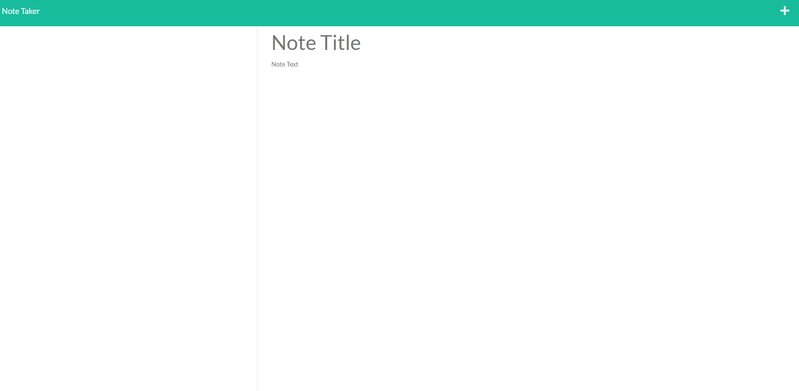

# **Note Taker Plus**

 

## Description:

## [_NoteTakerPlus_](https://hw-notetakerplus.herokuapp.com/notes) is an application designed to let users input personalized notes, information, and then save them to an easy to read list for the user to see. Our application uses an Express.js back end and retrieves note data from a JSON file. Users will be brought to our "landing page" and be able to follow the link attached to a buttton which will direct them to a "notes taking page" with input fields. In the upper right corner users will be able to select new notes and when they input text into the notes fields then a save button will become visible for the user to save their note.

 
 

## Usage and install:

#

Deployed on: Heroku

Dependencies used:

- express: v.4.16.4
- nodemon: v.2.0.15

Instal commands via terminal:

- "**npm i** " node modules instal
- "**npm i nodemon** " terminal instal

 
 

## WebPreview:

 
 

## Contact Us:

## Links:

GitHub Repo:
 
https://github.com/SmithCray/NoteTakerPlus

Heroku Deployed:
 
https://hw-notetakerplus.herokuapp.com/

Git Bio- Cray Smith
 
https://github.com/SmithCray

## Copyright (c) [2021] [Cray Smith]

#

Permission is hereby granted, free of charge, to any person obtaining a copy
of this software and associated documentation files (the "Software"), to deal
in the Software without restriction, including without limitation the rights
to use, copy, modify, merge, publish, distribute, sublicense, and/or sell
copies of the Software, and to permit persons to whom the Software is
furnished to do so, subject to the following conditions:

The above copyright notice and this permission notice shall be included in all
copies or substantial portions of the Software.

THE SOFTWARE IS PROVIDED "AS IS", WITHOUT WARRANTY OF ANY KIND, EXPRESS OR
IMPLIED, INCLUDING BUT NOT LIMITED TO THE WARRANTIES OF MERCHANTABILITY,
FITNESS FOR A PARTICULAR PURPOSE AND NONINFRINGEMENT. IN NO EVENT SHALL THE
AUTHORS OR COPYRIGHT HOLDERS BE LIABLE FOR ANY CLAIM, DAMAGES OR OTHER
LIABILITY, WHETHER IN AN ACTION OF CONTRACT, TORT OR OTHERWISE, ARISING FROM,
OUT OF OR IN CONNECTION WITH THE SOFTWARE OR THE USE OR OTHER DEALINGS IN THE
SOFTWARE.
